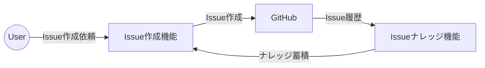
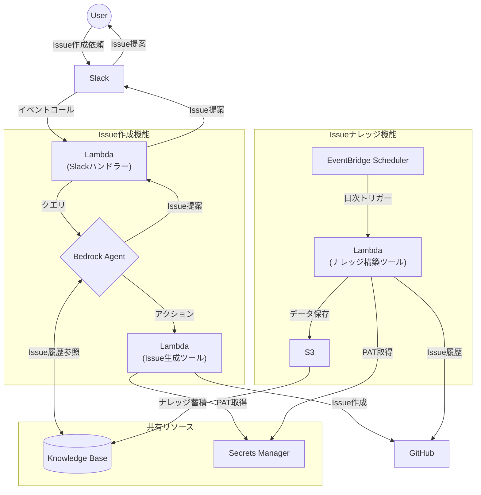
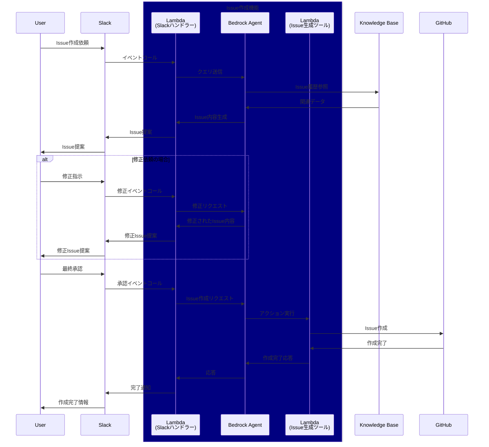
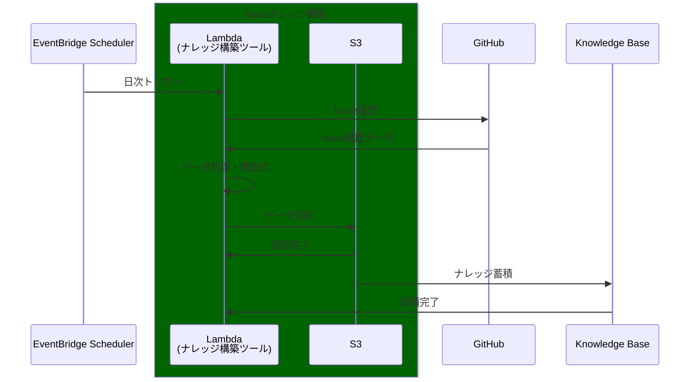
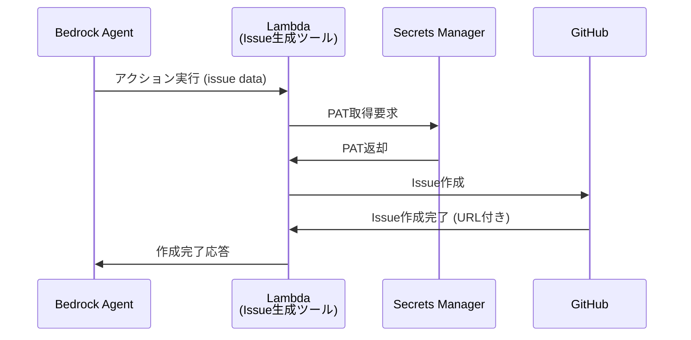
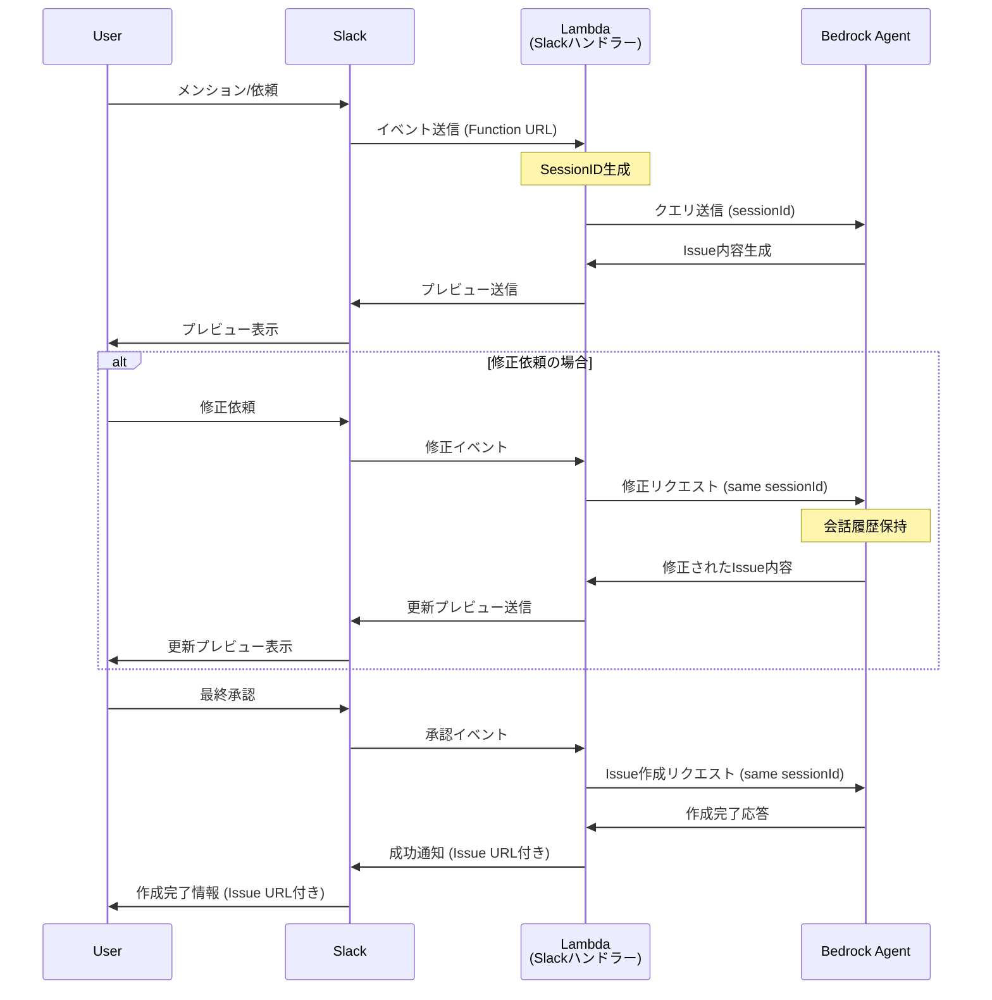
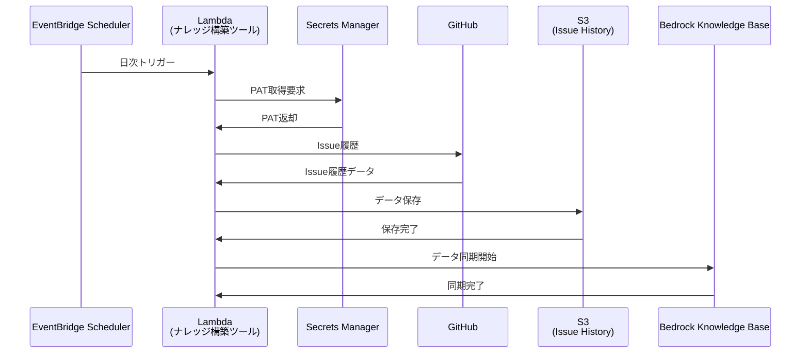

# システム設計

## 概要

AWS Bedrockを活用したSlackベースのIssue起票システム。ユーザーがSlackから依頼すると過去のIssue履歴を参照しつつAIが適切なIssueを自動生成することで、ユーザーのIssue作成の負担を軽減します。

主な特徴：

- **Slack連携**: メンションベースの直感的なIssue作成インターフェース
- **AI支援**: 過去のIssue履歴を参照した適切なIssue内容の自動生成
- **対話式修正**: プレビュー確認と修正依頼による段階的なIssue精度向上
- **自動学習**: クローズ済みIssueの日次収集によるナレッジベース更新

## システム設計

### 機能一覧

| 機能名 | 概要 |
|--------|------|
| Issue作成機能 | ユーザーからの依頼によりAIが過去履歴を参考にしながらGitHub Issueを自動生成する機能 |
| Issueナレッジ機能 | GitHub Issue履歴を収集・蓄積してAI学習用ナレッジベースを構築する機能 |

### 機能関連図



## アーキテクチャ

<details>
<summary>システム全体アーキテクチャ図</summary>



</details>

## 機能シーケンス

### Issue作成機能

<details>
<summary>Issue作成機能シーケンス図</summary>



</details>

### Issueナレッジ機能

<details>
<summary>Issueナレッジ機能シーケンス図</summary>



</details>

## アプリケーション設計

### Issue生成ツール (issue_generator)

#### 概要

Bedrock Agentからのアクション呼び出しで起動し、GitHub Issueを作成するLambda関数

#### 入力

<details>
<summary>Bedrock Agentからの入力JSONスキーマ</summary>

```json
// Bedrock Agentからの入力
{
  "messageVersion": "string",
  "agent": {
    "name": "string",
    "id": "string",
    "alias": "string",
    "version": "string"
  },
  "inputText": "string",
  "sessionId": "string",
  "actionGroup": "string",
  "apiPath": "string",
  "httpMethod": "string",
  "parameters": [
    {
      "name": "repository",
      "type": "string",
      "value": "string"
    },
    {
      "name": "title",
      "type": "string",
      "value": "string"
    },
    {
      "name": "body",
      "type": "string",
      "value": "string"
    },
    {
      "name": "labels",
      "type": "array",
      "value": "string" // JSON配列文字列
    }
  ]
}
```

</details>

#### 処理

Bedrock Agentからのアクション呼び出しを受けて、Secrets ManagerからGitHub PATを取得し、GitHub API経由でIssueを作成して結果を返却します。

<details>
<summary>Issue生成ツール処理シーケンス図</summary>



</details>

#### 出力

<details>
<summary>Bedrock Agentへのレスポンス</summary>

```json
// Bedrock Agentへの出力
{
  "messageVersion": "1.0",
  "response": {
    "actionGroup": "issue-creator",
    "apiPath": "/create-issue",
    "httpMethod": "POST",
    "httpStatusCode": 200,
    "responseBody": {
      "application/json": {
        "body": "{\"issue_url\": \"GitHub Issue URL\", \"issue_number\": 123, \"status\": \"created\"}"
      }
    }
  }
}
```

</details>

### Slackハンドラー (slack_handler)

#### 概要

Slackのapp_mentionイベントで起動し、Bedrock Agentとやり取りしてSlackに応答するLambda関数

#### 入力

<details>
<summary>Slack Events APIからのapp_mentionイベント</summary>

```json
// Slackからの入力
{
  "token": "認証トークン",
  "team_id": "Slackワークスペース ID",
  "api_app_id": "Slack アプリ ID",
  "event": {
    "type": "app_mention",
    "user": "メンションしたユーザー ID",
    "text": "メンション内容テキスト",
    "ts": "メッセージタイムスタンプ",
    "channel": "チャンネル ID",
    "event_ts": "イベントタイムスタンプ",
    "thread_ts": "スレッドタイムスタンプ（オプション）"
  },
  "type": "event_callback",
  "event_id": "イベント ID",
  "event_time": "Unix時刻",
  "authed_users": ["認証済みユーザー ID"]
}
```

</details>

#### 処理

Slack Events APIからのapp_mentionイベントを受信し、SessionIDを生成してBedrock Agentとやり取りを行い、応答をSlackに転送します。

<details>
<summary>Slackハンドラー処理シーケンス図</summary>



</details>

#### 出力

<details>
<summary>Slackへの応答とメッセージ投稿</summary>

Slackへの応答（HTTP 200 OK）：

```json
// Slackへの応答
{
  "statusCode": 200,
  "headers": {
    "Content-Type": "application/json"
  },
  "body": "OK"
}
```

Slack APIへのメッセージ投稿：

```json
// Slackメッセージ投稿
{
  "channel": "チャンネル ID",
  "text": "投稿メッセージテキスト",
  "thread_ts": "返信先スレッドタイムスタンプ（オプション）"
}
```

</details>

### ナレッジ構築ツール (knowledge_builder)

#### 概要

EventBridge Schedulerの日次スケジュールで起動し、GitHub Issue履歴を収集してS3保存・Knowledge Base更新するLambda関数

#### 入力

<details>
<summary>EventBridge Schedulerからの定期実行入力</summary>

```json
// EventBridgeからの入力
{
  "version": "0",
  "id": "イベント ID",
  "detail-type": "Scheduled Event",
  "source": "aws.scheduler",
  "account": "AWSアカウント ID",
  "time": "実行時刻（ISO 8601）",
  "region": "ap-northeast-1",
  "resources": ["スケジューラーARN"],
  "detail": {
    "target_date": "処理対象日（オプション）"
  }
}
```

</details>

#### 処理

EventBridge Schedulerからの日次実行により、前日クローズのIssue履歴をGitHub APIから取得し、Frontmatter Markdown形式でS3に保存してKnowledge Baseを更新します。

<details>
<summary>ナレッジ構築ツール処理シーケンス図</summary>



</details>

#### 出力

<details>
<summary>Lambda実行結果</summary>

```json
// 実行結果
{
  "statusCode": 200,
  "body": {
    "processed_issues": 15,
    "s3_files": ["保存されたファイルパス"],
    "knowledge_base_sync": {
      "ingestion_job_id": "取り込みジョブ ID",
      "status": "STARTING"
    },
    "execution_time": "実行時間（秒）"
  }
}
```

</details>

#### 保存データ形式

##### ファイル名形式

```
{repository}/{issue_number}_{closed_date}.md
```

##### Frontmatter Markdown形式

```markdown
---
issue_number: 123
title: "Issue タイトル"
state: "closed"
created_at: "2024-01-01T00:00:00Z"
closed_at: "2024-01-02T00:00:00Z"
assignee: "担当者名"
labels: ["bug", "priority-high"]
repository: "owner/repo-name"
url: "GitHub Issue URL"
---

# Issue本文

（GitHub IssueのBodyをそのまま記載）

## コメント履歴

### ユーザー名 (2024-01-01 12:00)
（コメント内容）

### ユーザー名 (2024-01-02 09:00)
（コメント内容）
```

## 設定詳細

### Bedrock Agent設定

- **Name**: `"dev-issue-creation-agent"`
- **Foundation Model**: `"anthropic.claude-v2"`
- **Instructions**: `"GitHub Issueの作成を支援するエージェント。過去のIssue履歴を参考に適切なタイトル、本文、ラベルを生成し、ユーザーとの対話を通じて内容を精査します。"`
- **Session TTL**: `3600秒`

**Action Group**:

- **Name**: `"issue-creator"`
- **Lambda Function**: issue_generator Lambda関数のARN
- **OpenAPI Schema**: 必須パラメータ `repository, title, body`、オプション `labels`

### Knowledge Base設定

- **Name**: `"dev-issue-history-knowledge-base"`
- **Embedding Model**: `"amazon.titan-embed-text-v2:0"`
- **Vector Store**: OpenSearch Serverless
- **Collection**: `"dev-bedrock-knowledge-base"`
- **Chunking**: Fixed Size 300トークン、20%オーバーラップ
- **Data Source**: S3バケット、`*.md`ファイルのみ

### セッション管理設定

SlackイベントのメタデータからSessionIDを決定論的に生成し、同一スレッド内では同じSessionIDを継続使用します。

- **Session ID Format**: `"{user_id}_{channel_id}_{root_timestamp}"`
- **制限**: 100文字以内、`[0-9a-zA-Z._:-]+`パターン
- **スレッド対応**: 同一スレッド内は同一SessionID

#### SessionID生成ロジック

スレッド返信時は`thread_ts`を、新規メンション時は`message_ts`をルートタイムスタンプとして使用し、`{user_id}_{channel_id}_{root_timestamp}`形式でSessionIDを生成します。

### Issue履歴抽出の定期実行設定

- **Name**: `"dev-issue-extractor-daily-schedule"`
- **Schedule**: `"cron(0 16 * * ? *)"`
- **Target**: knowledge_builder Lambda関数
- **Input**: `{"target_date": "previous_day"}`
- **Retry**: 3回、1時間以内
